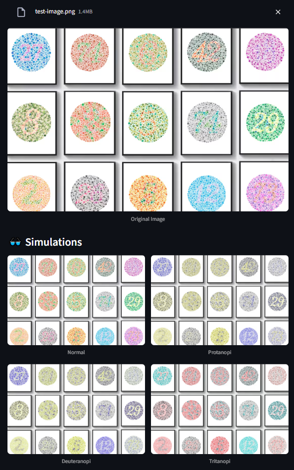

# 🎨 Color Blindness Simulator App

A simple Streamlit application that simulates how an image appears to people with different types of color blindness:
- **Protanopia** (red-blind)
- **Deuteranopia** (green-blind)
- **Tritanopia** (blue-blind)

## 🚀 Features

- Upload any image and instantly see how it looks under different color blindness types
- Built using Python, Streamlit, NumPy, and Pillow
- Fully containerized with Docker

---

## 📸 Preview

 <!-- Optional: Replace with a screenshot -->

---

## 🛠️ Installation (Without Docker)

```bash
pip install -r requirements.txt
streamlit run app.py
